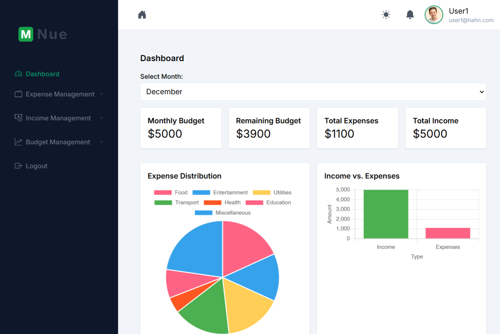
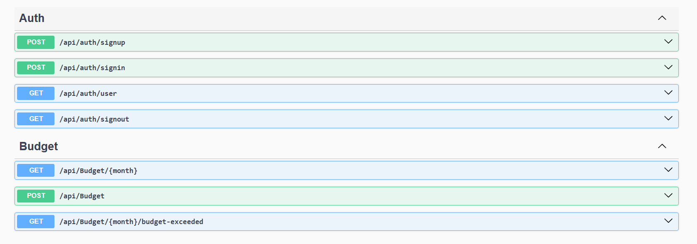
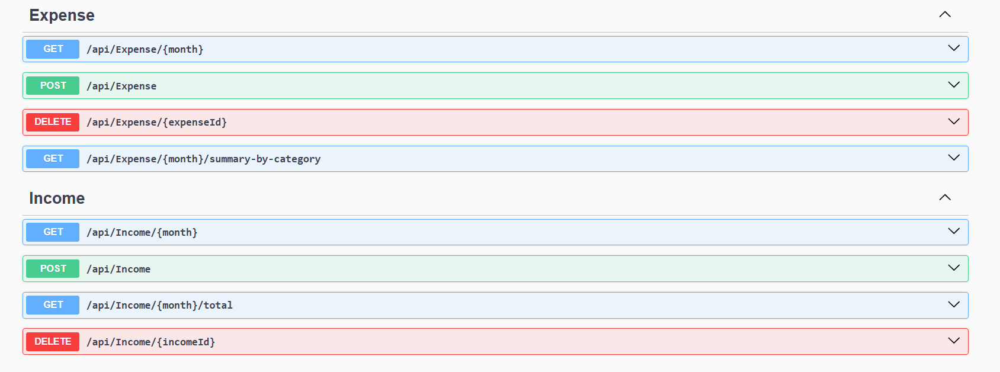
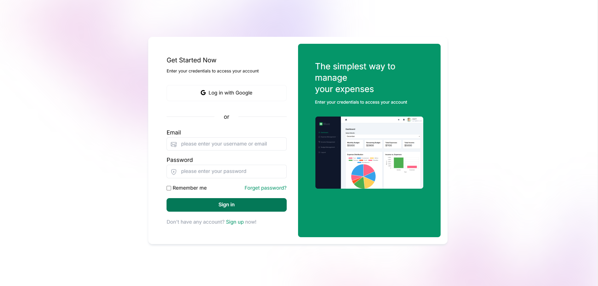
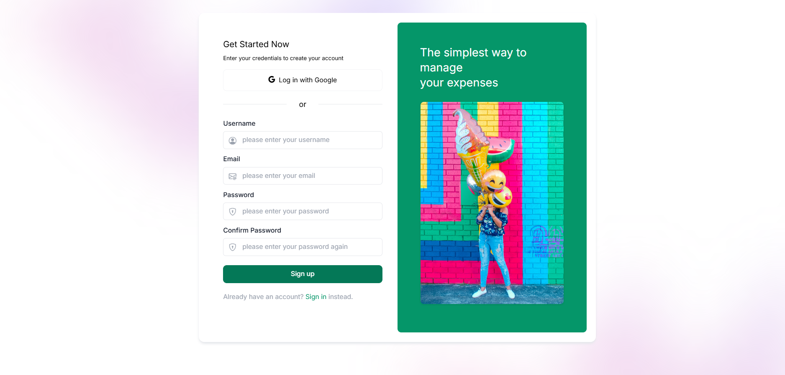
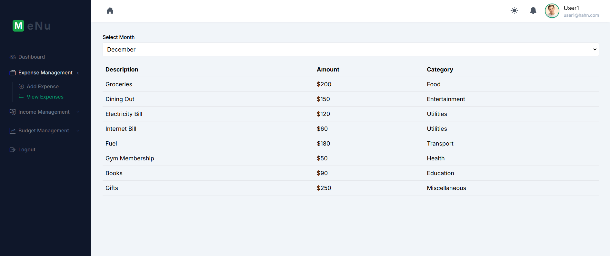
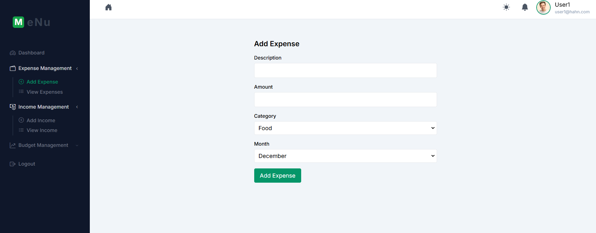

# ExpenseTracker

ExpenseTracker is a dockerized application for managing personal expenses, incomes, and budgets. It features cookie-based authentication, secured endpoints, and a user-friendly interface.

---

## Quick Setup

### Prerequisites
- Ensure **Docker** and **Docker Compose** are installed and running on your machine.

### Steps

1. **Clone the repository**:
   ```bash
   git clone <repo_url>
   cd ExpenseTracker
   ```

2. **Run Docker Compose**:
   Navigate to the folder containing the `docker-compose.yml` file and run:
   ```bash
   docker-compose up
   ```

3. **Access the application**:
   - **Frontend**: [http://localhost:4200](http://localhost:4200)
   - **Backend**: [https://localhost:8081](https://localhost:8081)

---

## Screenshots

## Preview









---

## Features

- **Expense Management**: Add, view, and categorize expenses.
- **Income Management**: Record multiple income sources.
- **Budget Management**: Set monthly budgets and get notified if exceeded.
- **Authentication**: Secure user login with cookies.
- **Dockerized**: Backend and frontend fully dockerized for easy deployment.

---

Enjoy using ExpenseTracker! 🚀
